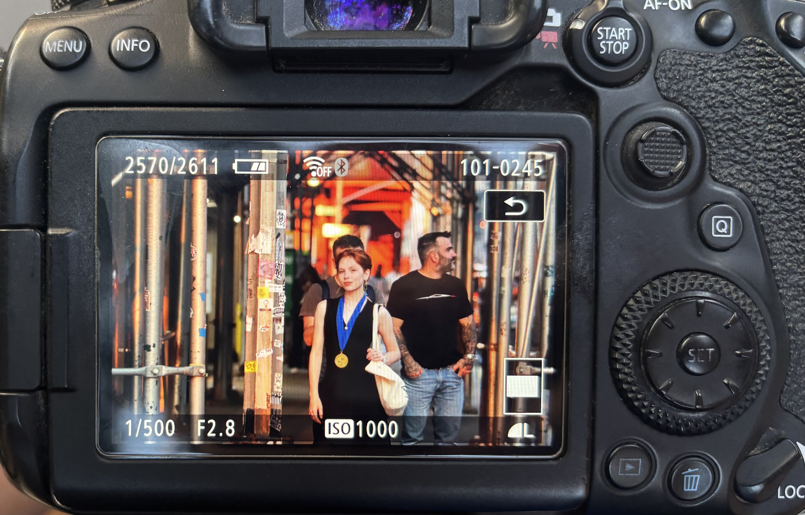

Savannah Massey is a poet originally from Mississippi studying engineering and applied mathematics at Kenyon College. They are the 2026 Youth Poet Laureate for Mississippi. Their portfolio, “The Queer South,” was given an Honorable Mention in Literature for the 2026 Davidson Fellowship Scholarship. Massey is a 2025 YoungArts Winner with Distinction in Poetry and a Scholastic Gold Medalist. They were a finalist in the 2025 Leonard Cohen Poetry Prize and an honorable mention in the 2025 Only Poems Poet of the Year Prize. Their work has been published in over 30 magazines; including Polyphony Lit, Scholastic Art & Writing, and the West Trade Review. 

### Where to find their work:

At the moment, they have not published any collections of work, however you can find some of their individual publications in the Publications dropdown in [Home](https://savannahmwriting-glitch.github.io).

### Contact Info:

I check my email regularly so feel free to reach out! I've also linked my social media if you want to keep up with me./
email: savannahm.writing@gmail.com/
Instagram: [Savannahmassey12](https://instagram/savannahmassey12)
